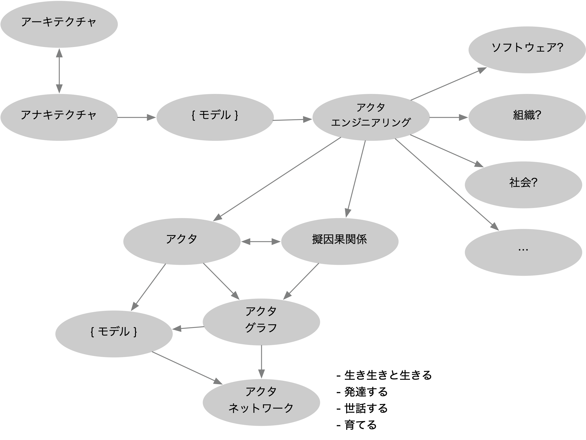
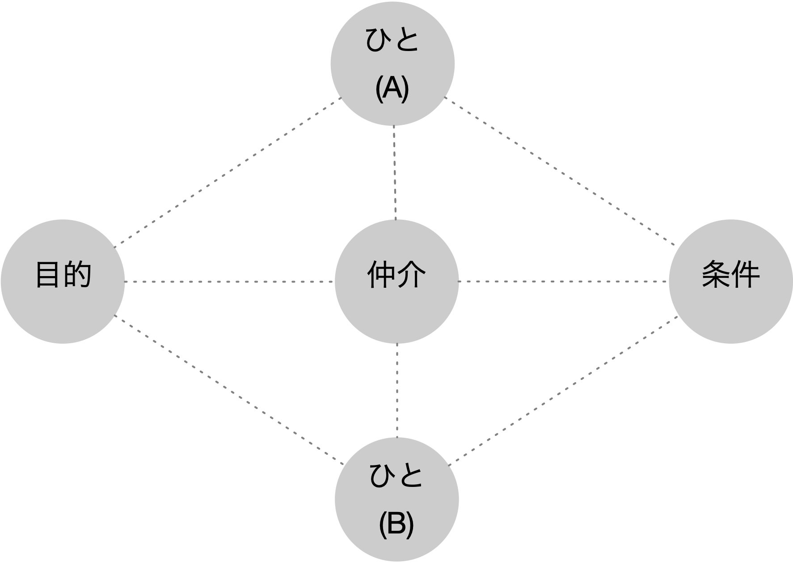

それでは, アクタ・エンジニアリングを使ってどのように世界に関わっていくのかを, 一緒に探求していきましょう.

## 最初のユースケース

最初のユースケースは, 次のようなものです.

```text
A 社本社二階には総合受付があり, そこには受付担当者を専門とする派遣会社から派遣された二名のスタッフが常駐している. 面会のための訪問者がある場合には, 面会予定の A 社従業員はその旨を文書として受付担当者にあらかじめ知らせておき, 受付担当者はそれを元に訪問者を関係する A 社従業員に取り次ぐ.
また, 受付担当者は面会室や設備, 資料の準備, 飲食の手配なども行う.
A 社では, 面会受付にかかるコストを削減するために, 現行の面会受付の方法を改めることにし, その提案が私たちに求められた.
```

「バッド・ユースケース」という名前の通り, アナキテクチャの立場からすると, これ自体がレガシな考え方です. そこには, 現在の多くの組織の制度, システム開発, DX などにおけるさまざまな問題が顕れていますが, ここでは, その中でも二つだけの問題点を挙げてみます.

### 代行可能性, エントロピの外部への (不法な) 投棄

このユースケースには, 「二人の派遣スタッフ」を「システム (のようなもの)」に置き換えることが簡単にできる, という考え方があります. いわゆる「エージェント (agent)」ですね. 自分が主体として行っている何かを, 他の何者かに置き換え, 代行させることによって, 効率化したい.

そもそも, この受付担当の派遣スタッフ自体が代行によって現れたアクタでした. 今度はさらにそれを「システム」的なアクタに代行させる. アクタの代行/置換によって, 実際にはアクタ・グラフには大きな影響が出ることになる (例えば二人の派遣スタッフが職を失う) のですが, そのような影響は外部化すれば, 無視してかまわない. なぜならば, そういう「契約」に基づいているのだし, そのために「金銭を支払っている」のだから.

### 測定可能性, 単調で排除的な測度への (過度な) 依存

このユースケースのそもそもの動機となっているのは, 「コスト削減」でした.

「コスト」というのは, 非常に複雑で大規模な相互作用の結果として現れる, しかし多くの場合, 恣意的で偶然的なスコープや対応づけに基づく, 一つの数値です. それは, 全順序である (大小関係で一列に並べることができる) という以外には大した性質は持ちません (もちろん算術的ではありますが, その算術の意味論は大抵は不明です).

そこでは, それ以外の無数の測度は無視されています. それらのすべてを考慮することは困難だし, 考慮したところでこの経済圏という領域ではほぼ意味がない (ようにできている) からです.

アクタ・エンジニアリングを用いることによって, これらの問題を明らかにすることができるのか, これらの問題を乗り越える道を用意することができるのかは, まだ分かりません.<br>
それらも含めて, アクタ・エンジニアリングとは何かを探求していきたいと思います.

わたしたちは今, わたしたち自身もアクタとして埋め込まれているところの, アクタ・グラフの擬因果関係の海の中にいます.

## 復習

その前に, 少し復習です.

わたしたちは, 現在のさまざまな在り方に批判的な立場から, 特に技術的なものを含むアナキテクチャという考え方を進めていこうとしています.<br>
アナキテクチャは, 物事を考えたり, 作り出したり, 使ったりするに当たって, 常にどのような立場に立っているかという, (さまざまな) モデルを同時に提示します.<br>
そういうモデルの一つの例として, アクタ・エンジニアリング (行為者工学) というものを考えています.<br>
アクタ・エンジニアリングとは, すごく大雑把にいうと, 世界を無数のアクタ (行為者) が, 無数の擬因果関係によって繋がっているグラフ (アクタ・グラフ) だと思う, という視点です.<br>
そして, その上にわたしたちが見るようなさまざまな関係が生まれたり, 消えたりしているネットワーク (アクタ・ネットワークと仮に呼ぶ) があります.<br>
アナキテクチャとは, (アクタ・エンジニアリングの観点では) そのネットワークの中で一緒に生きながら, そのネットワークをうまく育てようとする技 (業, 事, 術) です.



_エッジ (線) のラベルは敢えてつけていません. どんなラベルが適切でしょうか?_

## すべての蠢くアクタども

このユースケースの本質を一言で言うとすると「ひとが何か目的があってひとと会うこと」と言えるでしょう. だったら, ぶらぶら歩いて行って, 「よっ」と顔を出せばいいだけの話です. たまたま相手が居なければ, 帰って出直す. それじゃ何がダメなんでしたっけ. これがいちばんまともな解決策ではないでしょうか?

この問題には, また後で戻ってくるとして, 今はそれをぼんやりと胸のうちにに抱えたまま, とりあえず先に進みましょう.

「ひとが何か目的があって (別の) ひとと会う」出来事には, まずは以下のようなアクタが現れるようです.

- ひと (A)
- ひと (B)
- 会う目的

今までのよくあるモデリング (例えばユースケース・モデリング, ビジネス・プロセス・モデリング/記法 (BPMN)) にも「アクタ」という用語, 概念は用いられています. ただしたいていは, アクタはひと, 組織などを, 場合によってシステムやソフトウェア・コンポネントなどを表すものとされています.

一方アクタ・エンジニアリングでは, 前に述べた通り, 行為するあらゆるものがアクタです. だから, 「ひと」だけではなく, 「会う目的」もアクタになるのですね. 「会う目的」はひとが抱く「考え」で, その行為を解釈することによって, 人は誰かに会いに行こうとするからです.

「考え」が行為する, という考え方を受け入れることができない人もいるとは思います. しかし, ひとが考えの影響を受けて行為をしてしまうことは, 想像できるでしょう? それによってひとが影響を受けている以上, 「考え」は行為していると言っていいよね? というのがアクタ・エンジニアリングの基本的な考え方の一つです.

さて, このユースケースは「単に会う」だけではなく, 「確実に会って, 目的を果たす」のが重要なのでしょうから, 「会う条件」と言うアクタもいるでしょう. それは例えば, いつ, どこで, どうやって会うか, というようなことから成り立っているでしょう.

- 会う条件

さらに, このユースケースを読むと, 来るひとと待つひとを仲介する「受付」というアクタも想定しているようです.

- 会うを仲介するひと

注意して欲しいのは, これらは基盤となる無数の (フラットな) 擬因果関係のアクタ・グラフ (それは普通はよく見えない) の上に生起するはずの, (部分的, 多面的, 動的な) アクタ・ネットワーク (モデル = 視点に応じて, 見えたり見えなかったり) であることです.

またここでは, いくつかのアクタは「ひと」と書かれていますが, 実際にひとであると限る必要はないことです. 何らかの性質を想定した行為者であり, それがひとか, ソフトウェアか, ロボットか, まったく別の物体か, 単なる抽象かは, 今は放っておいて構いません.



上の図で, 点線はアクタ・グラフのレベルでは擬因果関係を表しているのですが, 具体的にそれは何を意味しているのでしょう? あるいは, アクタ・ネットワークのレベルで, その中に埋め込まれている「わたし」アクタにとっては, 何として見えているのでしょう?
